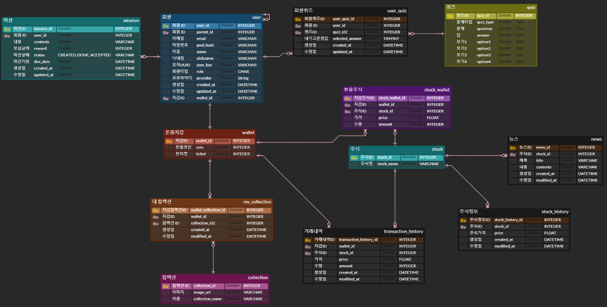

# 핀테크

## 카테고리

| Application | Domain | Language | Framework |
| ---- | ---- | ---- | ---- |
| :black_square_button: Desktop Web | :black_square_button: AI | :black_square_button: JavaScript | :black_square_button: Vue.js |
| :black_square_button: Mobile Web | :black_square_button: Big Data | ✅ TypeScript | ✅ React Native|
| :black_square_button: Responsive Web | :black_square_button: Blockchain | :black_square_button: C/C++ | :black_square_button: Angular |
| ✅ Android App | :black_square_button: IoT | :black_square_button: C# | ✅ Node.js |
| ✅ iOS App | :black_square_button: AR/VR/Metaverse | :black_square_button: Python | :black_square_button: Flask/Django |
| :black_square_button: Desktop App | ✅ FinTech | ✅ Java | ✅ Spring/Springboot |
| | | :black_square_button: Kotlin | |

<!-- 필수 항목 -->

## 프로젝트 소개

* 프로젝트명: 돈Zoom
* 서비스 특징: 부모의 아이 용돈 관리 및 아이의 능동적인 경제 교육을 위한 어플리케이션

* 주요 기능
- 부모의 아이 용돈 관리
- 아이의 퀴즈 풀기
- 아이의 모의투자
* 주요 기술
- 
* 배포 환경
- URL: 
- 테스트 계정: 

## 팀 소개
* 김주형
* 박영남
* 신순호
* 신호준
* 엄혜림
* 이유안

## 프로젝트 상세 설명
### 1️⃣ 개발 환경
#### - FE
React Native: 0.75
Axios: 1.7.2
Node: 22.5.1
Vite: 5.3.1
Typescript: 4.0.0
Zustand: 4.5.4
Nginx: 1.27.0
#### - BE
- 

### 2️⃣ 기술 스택
#### - FE
React Native, TypeScript, zustand, axios, firebase
#### - BE
Java, Spring Boot, JPA, MySQL

### 3️⃣ ERD
https://www.erdcloud.com/d/xS5Qjhr5Lee5rgLwR

### 4️⃣ Architecture

### 5️⃣ 상세 기능
#### - 
#### - 
#### - 
#### - 
#### - 
