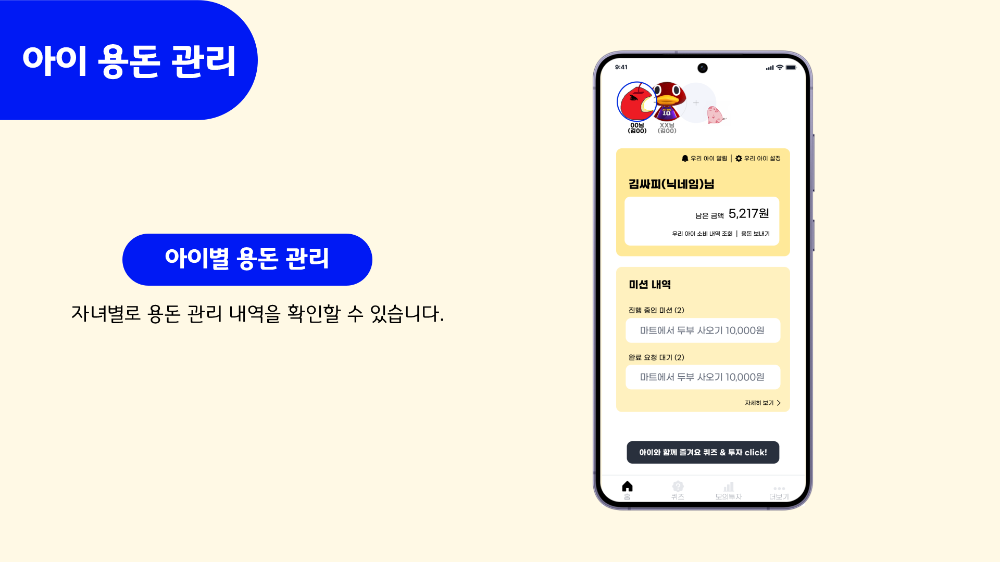
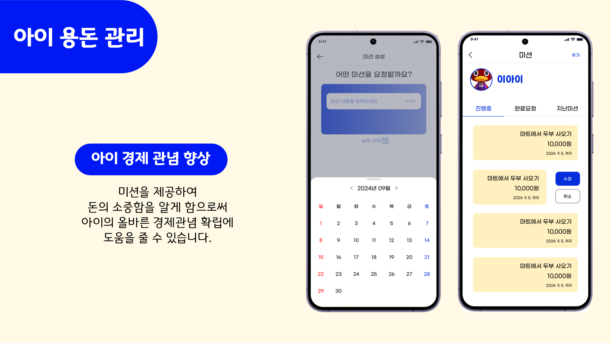
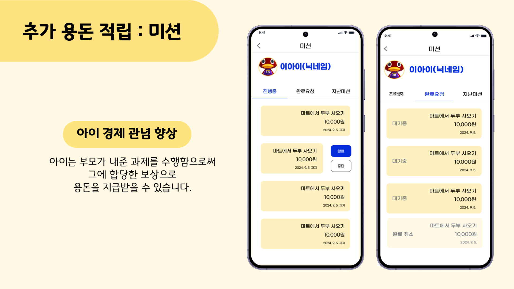
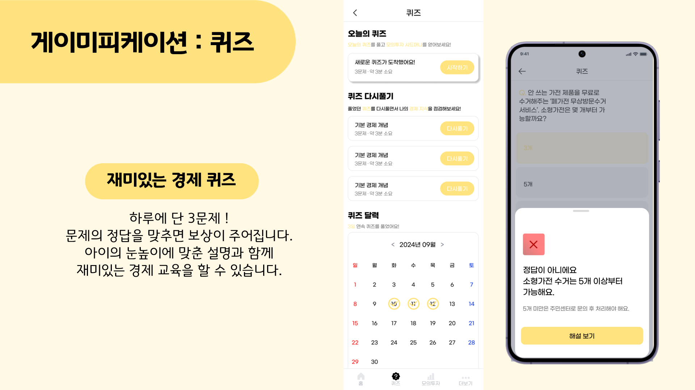
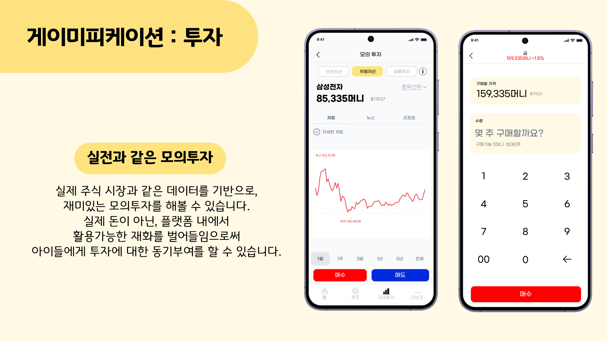
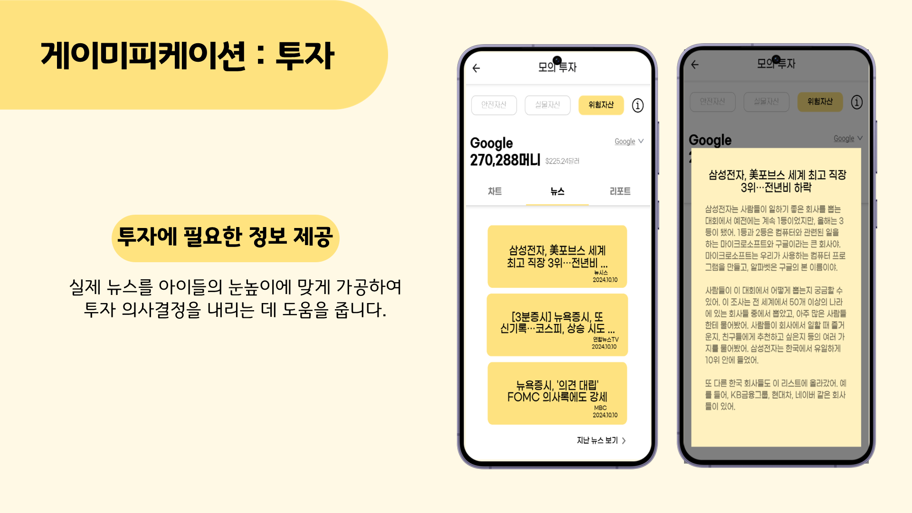
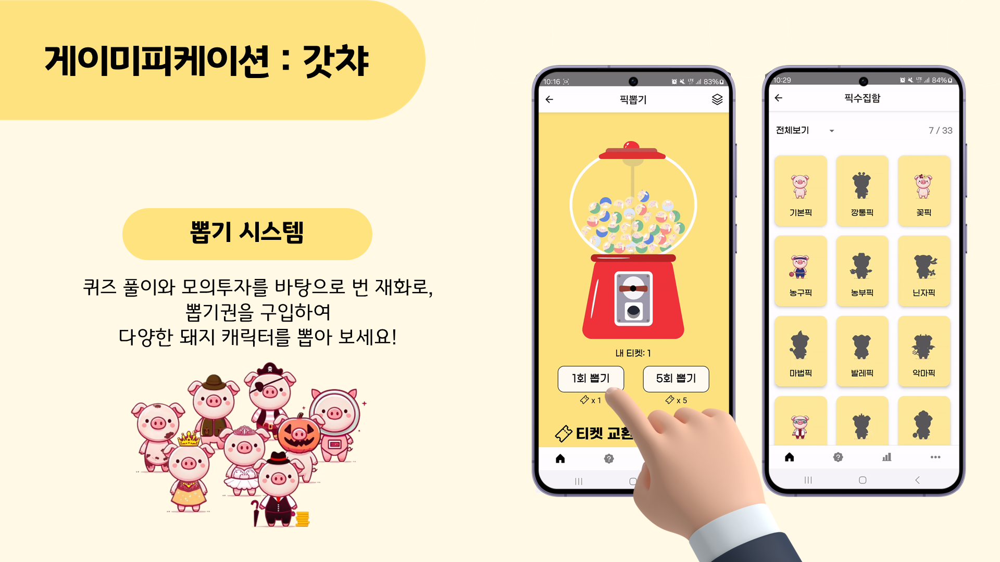
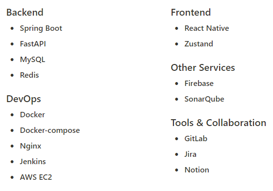

# 돈줌(돈zoom)
[삼성 청년 SW 아카데미 11기 특화 최우수 프로젝트]

## 프로젝트 소개
주제: 아이 용돈 관리 및 능동적 경제 교육을 위한 어플리케이션 

기획 배경: 체크카드 발급이 어렵거나 발급이 불가능한 미성년자의 경우 주로 부모의 신용카드를 쓰거나 현금을 활용하여 소비생활을 하는 불편함이 있습니다. 
"돈줌" 앱은 이러한 불편함을 해소하기 위해 아이가 계좌를 통해 부모로부터 용돈을 받고 QR 코드로 결제할 수 있는 기능을 제공합니다. 

부모는 아이의 올바른 소비습관 형성을 위하여 아이에게 용돈이 걸린 미션을 생성하거나 아이의 용돈 사용처를 확인할 수 있습니다.

또한 아이의 경제 교육을 위해 경제퀴즈, 기사, 모의 투자 기능을 제공하며, 동기부여를 위해 캐릭터 카드 뽑기 기능을 제공합니다. 

기능 소개:
- 부모의 아이 용돈관리: 계좌 송금 및 자동 이체, 용돈이 걸린 미션 생성, 용돈 사용 금액 제한
- 아이의 용돈 사용: QR결제, 용돈 사용내역 확인
- 경제 교육: 경제 퀴즈 및 기사(매일 업데이트), 모의 투자 및 자산형성
- 재미: 캐릭터 카드 뽑기(가챠)

## 인앱 이미지 

## 기술스택
